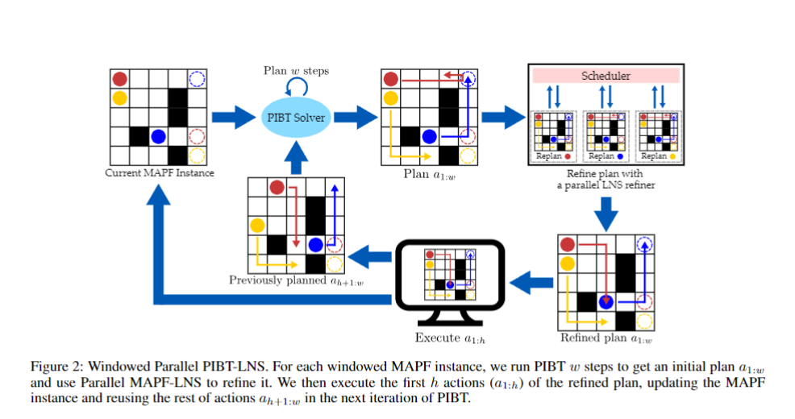

# MAPF-LRR2023
This is the repo for the team Pikachu's solution in the [League of Robot Competition 2023](https://www.leagueofrobotrunners.org/). We come from the [ARCS Lab](https://jiaoyangli.me/people/) at Robotics Institute, CMU. Our solution won the Overall Best and Fast Mover tracks and ranked second in the Line Honours track. 

## Notice
1. [To Update] We have a related paper submitted to [SoCS 2024](https://socs24.search-conference.org/home), which discusses our solution and important challenges in the Lifelong MAPF. 
2. [To Update] We use an automatic algorithm to generate guidance graphs (edge weights that encode moving costs) in the competition for the random map with 800 agents. This algorithm is not included in this repo. If you are interested, please refer to [this work](https://arxiv.org/abs/2402.01446) by one of our teammates, [Yulun](https://yulunzhang.net/).
3. The League of Robot Runner Competition also open source [solutions](https://github.com/MAPF-Competition/Code-Archive.git) from all teams with the [benchmark data](https://github.com/MAPF-Competition/Benchmark-Archive.git) used in the competition. This repo adds slightly more functionalities but most of the code remains the same as the one used in the competition. We may clean the code further in the future if we have time.
4. Our code includes [RHCR](https://github.com/Jiaoyang-Li/RHCR) code but doesn't use it eventually. Our code doesn't directly use the code from [PIBT](https://github.com/Kei18/pibt) repo, but uses a part of the [LaCAM2](https://github.com/Kei18/lacam2) code to execute the [PIBT](https://github.com/Kei18/pibt) algorithm. Our code doesn't directly use the code from [LNS](https://github.com/Jiaoyang-Li/MAPF-LNS), but uses a part of the [LNS2](https://github.com/Jiaoyang-Li/MAPF-LNS2) to execute [LNS](https://github.com/Jiaoyang-Li/MAPF-LNS) algorithm.
5. The team Shadocks that achieves a close score has [a paper](https://arxiv.org/abs/2303.07696) describing their heuristic design, which also helps them win another CG:SHOP Challenge.

## Algorithm Overview
We call our algorithm Windowed Parallel PIBT-LNS (WPPL). Essentially, it is a combination of [PIBT](https://github.com/Kei18/pibt), [LNS](https://github.com/Jiaoyang-Li/MAPF-LNS) and [RHCR](https://github.com/Jiaoyang-Li/RHCR). We also parallelize LNS to exploit multi-CPUs. Further, to address the problem of congestion, we apply a guidance graph, which encourages agents to execute certain actions at certain locations and disable some agents in a way that their goals are set to the current locations and their priorities to the lowest. For more details, please to our paper.

## Compile and Run Experiments
Before reading the following, you may want to take a look at the official documents of the competition in the `official_docs` folder.

To compile and run codes in this repo:
1. You may need to install boost, openmp and spdlog, e.g. by `sudo apt install libboost-all-dev libomp-dev libspdlog-dev`. If anything is still missing, you can check `apt.txt`.
2. Use `./compile.sh` to compile
3. Use `run.sh` to run all the experiments.
4. Official json-format logs will be generated at the output path specified by `-o`.
5. If compiled with `set(DEV on)`, the program will output more statistics in the command line and also output an analysis file in the path specified by the filed `analysis_output` in the configuration file introduced below.

## Experiment Configuraions
The command line options are the general settings for io and simulation. The configuration files describe the map-specific algorithm settings. The environment variables are some extra advanced settings.

### Command Line Options
All the command line options are defined in the `src/driver.cpp`. The following are the most important ones:
1. `--inputFile` The description file path of a problem instance.
2. `-o` The output file path.
3. `--planTimeLimit` The planning time limit for each execution step in seconds. In the competition, it is 1.
4. `--simulationTime` The total execution steps to simulate.

### Configuraion Files
The problem will automatically load the default configuration files in the `configs` folder, according to the map name. Please refer to `configs/random-32-32-20_annotated.json` for the explanation of each field.

### Environment Variables
1. `OMP_NUM_THREADS=<the number of threads>` How many threads to use to precompute heuristics.
2. `LNS_NUM_THREADS=<the number of threads>` How many parallel Large Neighborhood Search (LNS) threads are used to refine plans.
3. `CONFIG_PATH=<the path to a configuration file>` The path to a configuration file to replace the default one.
4. `MAP_WEIGHT_PATH=<the path to a map weight file>` The path to a map weight file (map weights = guidance graph). It will replace the one specified in the configuration file.

## Further Questions
If you have any questions, you can send me an [email](srevir@foxmail.com).
